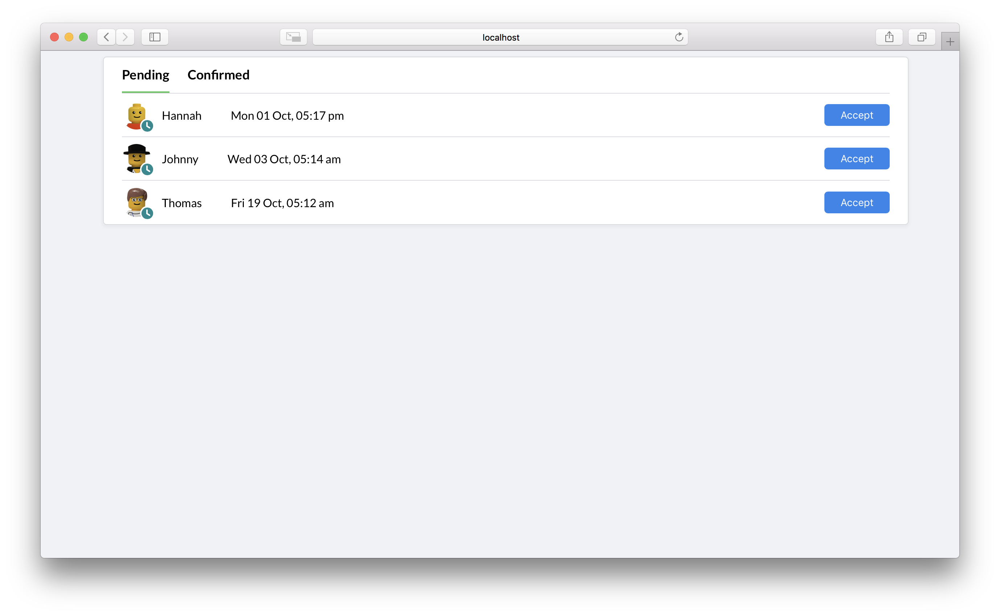

# react-bookings-example

## Screenshot




## Requirements
I used the following installed versions to build this project:

- node v9.11.2
- npm 5.6.0
- yarn 1.9.4
- macOS Hight Sierra 10.13.6
- Google Chrome 69.0.3497.92 (Official Build) (64-bit)

I prefer to use [node version manager](https://github.com/creationix/nvm) to manage different versions of nodejs on your computer
```
$ curl -o- https://raw.githubusercontent.com/creationix/nvm/v0.33.11/install.sh | bash
$ nvm install 9.11
$ nvm use 9.11
```

Make sure all dependencies have been installed before moving on:

```
yarn
// or
npm install
```


## Run project
```
yarn start
```

## Testing
tests are more or less useless, but I wanted to show how I'd write tests.

```
yarn test
```

## Booking object
```
{
  id: 1,
  name: 'Kenneth L',
  time: '2018-10-03T03:17:22.552Z',
  status: 1, // 1 = pending, 2 = accepted, 3 = canceled
}
```

---

Copyright (c) 2018 [Dominic Kolbe](https://dominickolbe.dk)
